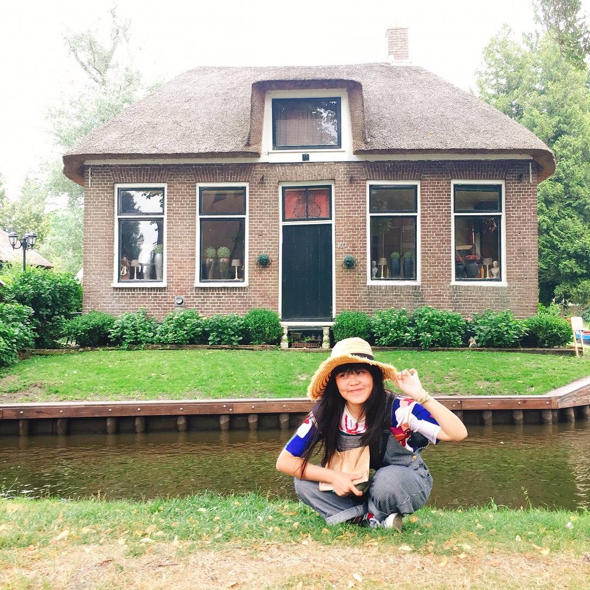

```{r setup, include=FALSE}
knitr::opts_chunk$set(echo = TRUE)

#Packages

library(tidyverse)
library(knitr)
library(skimr)
library(ggplot2)

```

## *Hsin-Chieh Tang* **s4647300**

---

# Assignment 2

---


---

### Dataset

This dataset is regarding a survey from 1,058 American respondents responses about what they eat on Thanksgiving in 2015. I have named this dataset to `thanksmeals`.

```{r}

thanksmeals <- read_csv("thanksgiving_meals.csv")

```

### Part 2: Data Wrangling and Visualization (60 Marks)

For all tables below, you need to use the RMarkdown functionality to present tables (`kable`). 

### 1. Display the first 10 rows of the dataset using RMarkdown

write something

```{r}

head(thanksmeals, 10) %>% kable()

```
### 2. Use `fct_reorder` and `parse_number` functions to create a factor variable `family_income`

write something  try other things because not sure how to display/not sure Q

```{r}

family_income <- thanksmeals %>% 
  mutate(family_income = fct_reorder(family_income, parse_number(family_income)))

skim(family_income)

```

### 3. Generate the general statistics of the dataset using `summary()` and `skim()` function (2 mark).

write something the difference I saw

```{r}

summary(thanksmeals)

skim(thanksmeals)

```
### 4. What is the number of people who celebrate?

write something

```{r}

thanksmeals %>% 
  filter(celebrate == "Yes") %>% 
  count(celebrate) %>% 
  kable(caption = "Count")

```

### 5. What are categories and stats for each main dish served and the method it is prepared?

write something

```{r}

#thanksmeals %>% count(main_prep) 

#thanksmeals %>% count(main_dish) 

#thanksmeals %>% count(main_prep_other)


#thanksmeals %>% count(main_dish_other, main_prep_other)

thanksmeals %>% 
  count(main_dish, main_prep, sort = TRUE) %>% 
  filter(!is.na(main_dish),
         !is.na(main_prep),
         !main_dish %in% c("Other (please specify)", "I don’t know"),
         !main_prep %in% c("Other (please specify)", "I don’t know")) %>% 
  kable(caption = "Categories for Prepared Method")


```

### 6. Create a data viz showing this in the most evident way. Provide your own legend and use themes.

write something second 2 is better

```{r}

thanksmeals %>% 
  filter(!is.na(main_dish)) %>% 
  count(main_dish, main_prep) %>% 
  mutate(main_dish = fct_reorder(main_dish, n)) %>% 
  ggplot(aes(main_dish, n, fill = main_prep)) +
  geom_col() +
  coord_flip() +
  theme_bw() +
  labs(x="Main Dish", y="Count", title="Categories for Main Dish Prepared Methods", caption = "Image 1:Bar Graph")

thanksmeals %>% 
  filter(!is.na(main_prep)) %>% 
  count(main_dish, main_prep) %>% 
  mutate(main_prep = fct_reorder(main_prep, n)) %>% 
  ggplot(aes(main_prep, n, fill = main_dish)) +
  geom_col() +
  coord_flip() +
  theme_bw() +
  labs(x="Prepared Methods", y="Count", title="Categories for Main Dish Prepared Methods", caption = "Image 1:Bar Graph")


```

### 7. How many use cranberry sauce? How many use gravy?

write something

```{r}

#There are 828 people used cranberry sauce.

thanksmeals %>% 
  filter(!is.na(cranberry) & !cranberry=="None") %>% 
  count(cranberry) %>% 
  select(n) %>% 
  summarise(cranberry_sauce = sum(n)) %>% 
  kable(caption = "How many")

#There are 892 people used gravy sauce.

thanksmeals %>% 
  filter(gravy=="Yes") %>% 
  count(gravy) %>% 
  kable(caption = "How many")

```

### 8. What is the distribution of those who celebrate across income ranges

write something

```{r}

thanksmeals %>% 
  filter(celebrate=="Yes",
         !is.na(family_income),
         !family_income %in% c("Prefer not to answer")) %>% 
  count(family_income, sort = TRUE) %>% 
  kable(caption = "Family Income Distribution")

```

### 9. Present this information in the most evident way on the data viz.

one variable discrete

```{r}

thanksmeals %>% 
  filter(celebrate=="Yes",
         !is.na(family_income)) %>% 
  count(family_income) %>% 
  mutate(family_income = fct_reorder(family_income,n)) %>% 
  ggplot(aes(family_income,n)) +
  geom_col(fill="#FF3399") +
  coord_flip() +
  theme_classic() +
  labs(x="Family Income", y="Number", title="The Distribution of Income by People who Celebrate Thanksgiving", caption = "Image 2:Bar Graph")
  
```

### 10. What are the most common pies, sides, and desserts?

write something

```{r}

#the most common pie is pumpkin pie

common_pie <- thanksmeals %>% 
  select(starts_with("pie")) %>% 
  gather(type,value) %>% 
  filter(!is.na(value),
         !value %in% c("None", "Other (please specify)","I don't know")) %>% 
  group_by(type) %>% 
  count(value) %>% 
  arrange(desc(n)) %>% 
  ungroup() %>% 
  mutate(type = str_remove(type, "\\d+"))

head(common_pie,10) %>% 
  kable(caption = "Common Pie")
  
#the most common side is mashed potatoes

common_side <- thanksmeals %>% 
  select(starts_with("side")) %>% 
  gather(type,value) %>% 
  filter(!is.na(value),
         !value %in% c("None", "Other (please specify)","I don't know")) %>% 
  group_by(type) %>% 
  count(value) %>% 
  arrange(desc(n)) %>% 
  ungroup() %>%
  mutate(type = str_remove(type, "\\d+"))


head(common_side,10) %>% 
  kable(caption = "Common Side")

#the most common dessert is ice cream

common_dessert <- thanksmeals %>% 
  select(starts_with("dessert")) %>% 
  gather(type,value) %>% 
  filter(!is.na(value),
         !value %in% c("None", "Other (please specify)","I don't know")) %>% 
  group_by(type) %>% 
  count(value) %>% 
  arrange(desc(n)) %>% 
  ungroup() %>% 
  mutate(type = str_remove(type, "\\d+"))

head(common_dessert,10) %>% 
  kable(caption = "Common Dessert")

```

### 11. Present this information on a data viz

write something -3  has difficulty

fct_lump: Lump together least/most common factor levels into "other"

```{r}


common_pie %>% 
  mutate(value = fct_reorder(value,n)) %>% 
  ggplot(aes(value,n))+
  geom_col()+
  coord_flip()+
  theme_gray()

common_pie %>% 
  count(value=fct_lump(value,12), sort = TRUE) %>% 
  mutate(value = fct_reorder(value,n)) %>% 
  ggplot(aes(n,value))+
  geom_col()

common_pie %>% 
  mutate(value = fct_lump(value, 12),
    value = fct_reorder(value,n)) %>% 
  ggplot(aes(type,value))+
  geom_boxplot()

#labs(x="Type of Pie", y="Number", title="The Most Common Pie in Thanksgiving", caption = "Image 3:Bar Graph")

```

### 12. How do the servings differ by income?

write something not sure about this/try to think the kable suitable to the question

```{r}

#In Q12, you should compare between family_income and main_dish.

servings_income <- thanksmeals %>%
  select(main_dish,family_income) %>% 
  filter(!is.na(main_dish),
         !is.na(family_income),
         !main_dish %in% c("Other (please specify)", "I don't know"),
         !family_income %in% c("None", "Prefer not to answer")) %>%
  group_by(main_dish) %>% 
  count(main_dish, family_income, sort = TRUE) %>% 
  ungroup()

head(servings_income,10) %>% 
  kable(caption = "Comparison")


thanksmeals %>%
  select(main_dish,family_income) %>% 
  filter(!is.na(main_dish),
         !is.na(family_income),
         !main_dish %in% c("Other (please specify)", "I don't know"),
         !family_income %in% c("None", "Prefer not to answer")) %>%
  group_by(family_income) %>% 
  count(family_income, main_dish, sort = TRUE) %>% 
  ungroup()
```

### 13. Present this information on a data viz

write something -4 bloxplot

```{r}

thanksmeals %>% 
  select(main_dish,family_income) %>% 
  filter(!is.na(main_dish),
         !is.na(family_income),
         !family_income %in% c("None", "Prefer not to answer")) %>%
  group_by(main_dish) %>% 
  arrange(family_income) %>% 
  ungroup() %>% 
  ggplot(aes(main_dish,family_income))+
  geom_boxplot()


servings_income %>% 
  group_by(main_dish) %>% 
  mutate(family_income = fct_reorder(family_income, n)) %>% 
  arrange(family_income) %>% 
  ungroup() %>% 
  ggplot(aes(family_income,n, fill=main_dish))+
  geom_col()+
  coord_flip()+
  facet_wrap(~main_dish)


#labs(x="Family Income", y="Count", title="The Comparison between Family Income and Main Dish", caption = "Image 4:Bar Graph")

```

